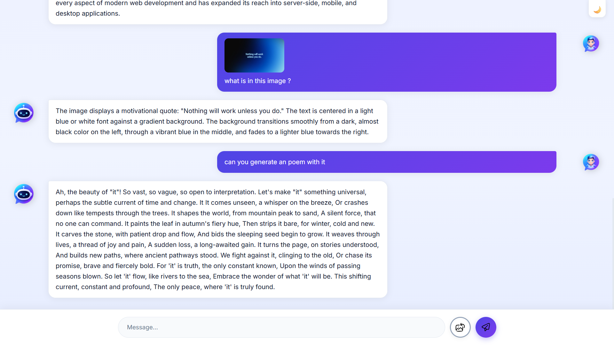

<p align="center">
  
</p>

<h1 align="center">🤖 Echo AI</h1>

<p align="center">
  A modern AI chatbot powered by <b>Google Gemini</b>, featuring secure backend integration, image analysis, and a clean user experience.
</p>

<p align="center">
  <a href="https://echo-five-pink.vercel.app"><strong>🌐 Live Demo</strong></a> •
  <a href="https://github.com/mugesh477/Echo"><strong>📂 Repository</strong></a>
</p>

---

# ✨ Features

- 💬 AI-powered conversations
- 🖼️ Image upload & image analysis
- 🌙 Light / Dark mode
- ⌨️ Press Enter to send
- 📜 Auto scrolling chat
- 🔒 Secure backend API
- ☁️ Fully deployed on Vercel & Render

---

# 🛠️ Tech Stack

| Category | Technologies |
|-----------|--------------|
| Frontend | HTML5, CSS3, JavaScript |
| Backend | Node.js, Express.js |
| AI | Google Gemini API |
| Deployment | Vercel, Render |

---

# 📸 Preview

## ☀️ Light Theme


---

## 🌙 Dark Theme


---

## 🖼️ Image Analysis



---

# ⚙️ Installation

### Clone Repository

```bash
git clone https://github.com/mugesh477/Echo.git
```

### Install Backend

```bash
cd server
npm install
node server.js
```

Open `src/index.html` using Live Server.

---

# 🔑 Environment Variables

Create a `.env` file inside the `server` folder.

```env
GEMINI_API_KEY=YOUR_GEMINI_API_KEY
PORT=3000
```

> **Note**
>
> The deployed version of Echo already uses a secure backend hosted on Render.
>
> If you want to run this project locally, you'll need to generate your own Gemini API key and add it to your `.env` file.

---

# 📁 Project Structure

```text
Echo
│
├── screenshots
├── server
├── src
└── README.md
```

---

# 🚀 Future Improvements

- 💾 Chat History
- 🎤 Voice Input
- 🔊 Voice Output
- 📋 Copy Responses
- 📝 Markdown Rendering
- 👤 User Authentication

---

# 🔒 Security

- API key stored securely on the backend
- Environment variables protect sensitive credentials
- API key is never exposed to the client

---

# 👨‍💻 Author

**Mugesh**

---

# ⭐ Support

If you like this project, consider giving it a ⭐ on GitHub.